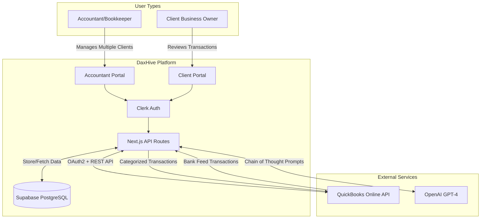
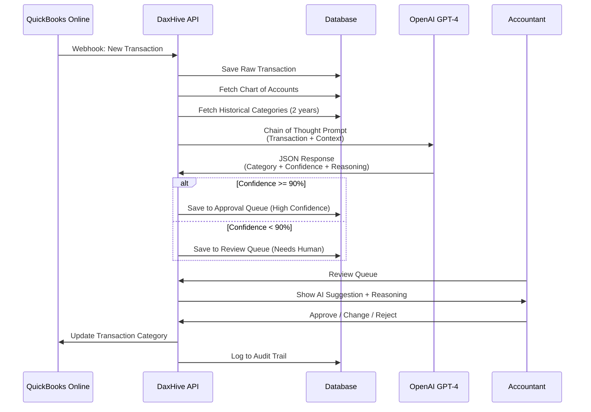
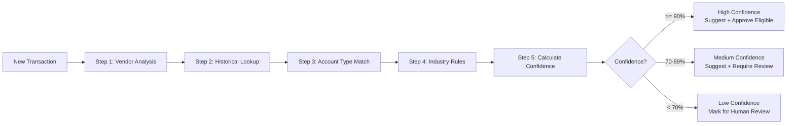
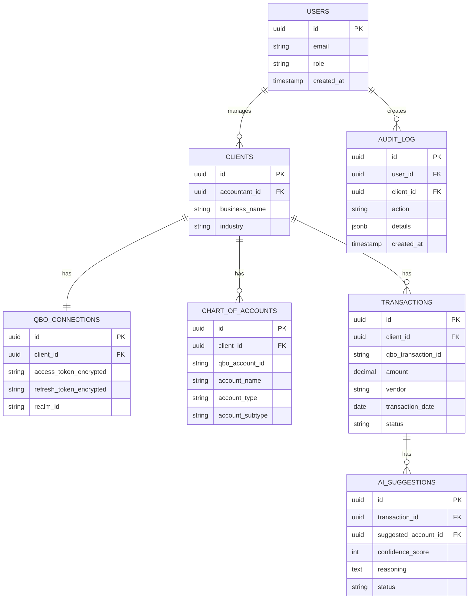

# DaxHive Architecture Overview

## System Architecture



## Data Flow: Transaction Categorization



## Two-Portal Architecture

### Accountant Portal
- **Dashboard**: Overview of all clients
- **Client Switcher**: Dropdown to switch between clients
- **Transaction Queue**: AI suggestions awaiting approval
- **Month-End Tools**: Checklists, reconciliation, reports
- **Settings**: Manage team, billing, integrations

### Client Portal
- **My Transactions**: Flagged items needing clarification
- **Upload Receipts**: Attach supporting documents
- **Answer Queries**: Respond to accountant questions
- **Reports**: View-only P&L, Balance Sheet

## AI Chain of Thought Process



## Database Schema (Simplified)



## Guardrails Summary

| Guardrail | Implementation | Purpose |
|-----------|---------------|---------|
| **Confidence Threshold** | 90% minimum for auto-suggest | Prevent incorrect categorizations |
| **Approval Queue** | All suggestions visible before posting | Human oversight required |
| **Audit Trail** | Log every action with user + timestamp | Compliance and debugging |
| **Rollback Capability** | "Undo" button for last 30 days | Recover from mistakes |
| **Daily Digest Email** | Summary of all AI actions | Keep accountant informed |
| **Data Isolation** | Client data never crosses boundaries | Multi-tenant security |
| **Encrypted Tokens** | QBO tokens use AES-256 encryption | Protect OAuth credentials |

## Industry-Specific Handling

### Auto-Detection Logic
```typescript
function detectIndustry(chartOfAccounts) {
  const accountNames = chartOfAccounts.map(a => a.account_name.toLowerCase());
  
  if (accountNames.includes('inventory') && accountNames.includes('cogs')) {
    return 'Retail/Manufacturing';
  }
  if (accountNames.includes('rental income')) {
    return 'Real Estate';
  }
  if (accountNames.includes('billable hours')) {
    return 'Professional Services';
  }
  // ... more rules
  
  return 'General Business';
}
```

### Account Type Mapping
| Account Type | Debit Increases | Credit Increases | Common Examples |
|--------------|----------------|------------------|-----------------|
| **Asset** | ✓ | | Cash, Inventory, Equipment |
| **Liability** | | ✓ | Loans, Credit Cards, A/P |
| **Equity** | | ✓ | Owner's Equity, Retained Earnings |
| **Income** | | ✓ | Sales, Services, Interest |
| **Expense** | ✓ | | Rent, Salaries, Supplies |
| **COGS** | ✓ | | Raw Materials, Direct Labor |
