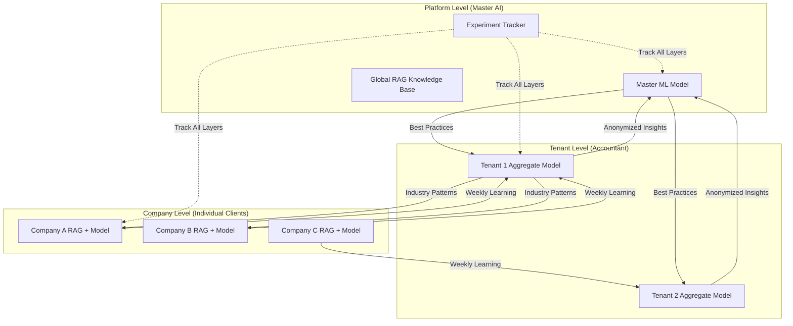
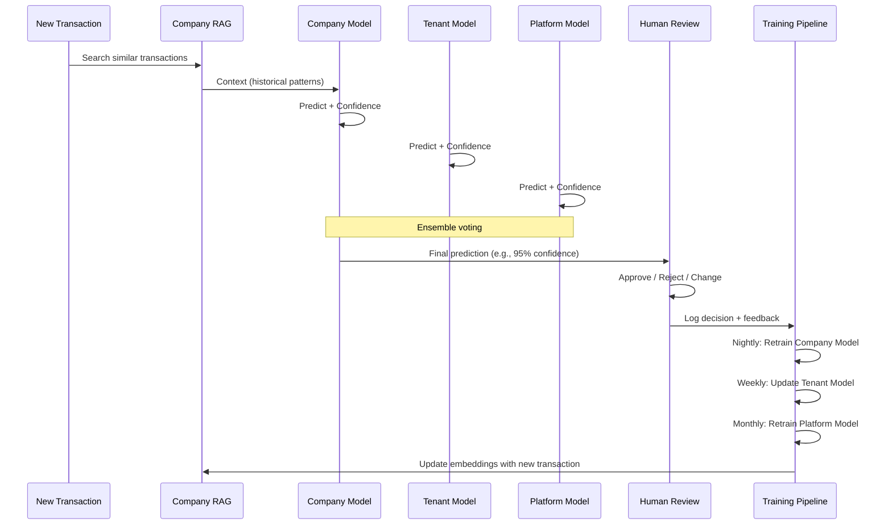

# DaxHive ML-First Architecture (REVISED)

## Vision
Build a **self-improving, hierarchical AI platform** where:
1. Each **company** gets its own RAG + fine-tuned model
2. Each **tenant** (accountant) aggregates learnings across their clients
3. The **platform** maintains a master AI that learns from all tenants (anonymized)
4. **DOE (Design of Experiments)** framework enables continuous learning from every decision

---

## Three-Tier Learning Hierarchy



---

## Component Breakdown

### 1. Company-Level RAG System

**When:** New client connects QBO  
**What Gets Created:**
- ✅ Dedicated vector database namespace (Qdrant collection: `company_{id}`)
- ✅ Custom embedding index with:
  - Chart of Accounts (semantic search on account names/descriptions)
  - 2 years historical transactions (vendor patterns, amounts, categories)
  - Uploaded receipts/invoices (OCR text)
  - Memo field patterns
  - Industry-specific rules

**Technology Stack:**
- **Vector DB**: Qdrant (self-hosted) or Pinecone (cloud)
- **Embeddings**: `text-embedding-3-small` (OpenAI) or `all-MiniLM-L6-v2` (local, fast)
- **Storage**: S3-compatible (Supabase Storage or Cloudflare R2)

**RAG Query Process:**
```typescript
// When categorizing a new transaction:
const relevantContext = await qdrant.search({
  collection: `company_${clientId}`,
  vector: await embed(transaction.vendor + " " + transaction.memo),
  limit: 10,
  filter: {
    account_type: transaction.estimatedType, // Asset, Expense, etc.
  }
});

// Returns: Similar historical transactions with their correct categories
```

---

### 2. Company-Level Fine-Tuned Model

**Model Choice:** Small, fast transformer
- **Base**: DistilBERT (66M params) or BERT-tiny (4.4M params)
- **Fine-tuning**: Classification head for account prediction
- **Input Features**:
  - Vendor name (embedded)
  - Transaction amount (normalized)
  - Date (day of week, month, quarter)
  - Memo/description (embedded)
  - Account context from RAG

**Training Pipeline:**
1. **Initial Training**: When client connects, train on 2 years of historical data
2. **Continuous Learning**: Retrain nightly with new approved categorizations
3. **Storage**: Model weights stored in S3 (`models/company_{id}/v{timestamp}.pt`)

**When to Use:**
- **RAG + GPT-4**: For new/uncertain transactions (confidence boost)
- **Fine-tuned Model Only**: For known vendors (faster, cheaper)
- **Ensemble**: Average predictions from both, use highest confidence

---

### 3. Tenant-Level Aggregate Model

**Purpose:** Learn patterns across all of an accountant's clients

**What It Learns:**
- Common vendor → category mappings (e.g., "AWS" → "Cloud Services" across 20 clients)
- Industry-specific rules (e.g., all real estate clients categorize "HOA fees" similarly)
- Seasonal patterns (e.g., tax preparation surge in Q1)

**Architecture:**
- **Shared RAG**: Stores cross-client patterns (anonymized vendor names preserved)
- **Transfer Learning**: When a new client joins, initialize their model with tenant-level weights

**Privacy:**
- Company names anonymized (`Company_A`, `Company_B`)
- Dollar amounts normalized (remove actual values, keep ranges)
- Only vendor names + categories shared

---

### 4. Platform-Level Master AI

**Purpose:** The "brain" that improves the entire platform

**What It Does:**
1. **Pattern Mining**: Discovers universal categorization rules
   - "Uber" → Travel (95% of the time)
   - "Starbucks" → Meals & Entertainment (80%) OR Office Supplies (20% - coffee for office)
2. **Anomaly Detection**: Flag unusual categorizations
   - If "Rent" is categorized as "Marketing" → alert for review
3. **Best Practice Distribution**: Push learnings to all tenants
4. **Industry Classification**: Cluster companies by spending patterns

**Technology:**
- **Model**: Large ensemble (XGBoost + Neural Network)
- **Training**: Weekly on aggregated data
- **Deployment**: Centralized, serves predictions via API

---

## DOE (Design of Experiments) Framework

### Philosophy
**Every categorization is an experiment.** We track:
- What the AI predicted
- What confidence level
- What the human chose
- WHY they chose it (optional feedback)

### Experiment Tracking

**Tools:** MLflow or Weights & Biases

**Tracked Metrics:**
```typescript
{
  experiment_id: "exp_20260120_company_abc_123",
  timestamp: "2026-01-20T15:00:00Z",
  
  // Input
  transaction: { vendor: "Staples", amount: 47.32, memo: "Office supplies" },
  
  // Model Predictions
  predictions: {
    company_model: { account: "6100", confidence: 0.92 },
    tenant_model: { account: "6100", confidence: 0.88 },
    platform_model: { account: "6100", confidence: 0.95 },
    rag_context: [/* similar transactions */]
  },
  
  // Ensemble Decision
  final_prediction: { account: "6100", confidence: 0.95 },
  
  // Human Decision
  human_choice: { account: "6100", approved: true, feedback: null },
  
  // Outcome
  was_correct: true,
  latency_ms: 342
}
```

### A/B Testing Framework

Test different strategies:
- **Experiment A**: Use RAG + GPT-4 for all transactions
- **Experiment B**: Use fine-tuned model for known vendors, GPT-4 for new
- **Experiment C**: Ensemble with weighted voting

**Metrics:**
- Accuracy (% correct on first try)
- Confidence calibration (is 95% confidence actually 95% accurate?)
- Latency (time to prediction)
- Cost (API calls to OpenAI)

**Implementation:**
```typescript
// Randomly assign 10% of transactions to experimental variants
if (Math.random() < 0.1) {
  variant = selectExperiment(clientId);
  prediction = variantPredict(transaction, variant);
  logExperiment(variant, prediction, ...);
}
```

---

## Continuous Learning Pipeline



---

## Data Flow Architecture

### Database Schema (Extended)

```sql
-- Company-specific RAG documents
CREATE TABLE rag_documents (
  id UUID PRIMARY KEY,
  company_id UUID REFERENCES clients(id),
  document_type VARCHAR, -- 'transaction', 'coa', 'receipt', 'rule'
  content TEXT,
  embedding VECTOR(384), -- For pgvector
  metadata JSONB,
  created_at TIMESTAMP
);

-- Model versions
CREATE TABLE ml_models (
  id UUID PRIMARY KEY,
  scope VARCHAR, -- 'company', 'tenant', 'platform'
  scope_id UUID, -- company_id or tenant_id
  model_type VARCHAR, -- 'distilbert', 'ensemble', 'xgboost'
  version INT,
  s3_path VARCHAR,
  accuracy_metrics JSONB,
  trained_at TIMESTAMP
);

-- Experiment tracking
CREATE TABLE experiments (
  id UUID PRIMARY KEY,
  transaction_id UUID REFERENCES transactions(id),
  company_id UUID,
  variant_name VARCHAR,
  predictions JSONB, -- All model predictions
  human_decision JSONB,
  was_correct BOOLEAN,
  latency_ms INT,
  created_at TIMESTAMP
);

-- Feedback loop
CREATE TABLE categorization_feedback (
  id UUID PRIMARY KEY,
  transaction_id UUID,
  accountant_id UUID,
  ai_suggestion JSONB,
  final_category JSONB,
  feedback_text TEXT, -- "This vendor is always X, not Y"
  created_at TIMESTAMP
);
```

---

## Scalability & Performance

### Challenges & Solutions

| Challenge | Solution |
|-----------|----------|
| **1000+ companies × RAG** | Use Qdrant with multi-tenancy (1 collection per company) |
| **Model serving latency** | Cache models in Redis, use ONNX runtime (10x faster inference) |
| **Training compute** | Use spot instances on AWS/GCP, queue training jobs |
| **Vector search speed** | Index by company_id, use HNSW algorithm, limit to top 10 results |
| **Storage costs** | Compress old embeddings, archive models >90 days old |

### Performance Targets

- **Prediction latency**: <500ms (RAG search + model inference)
- **Training frequency**: Nightly for active companies
- **Accuracy**: >95% within 30 days of onboarding
- **Cost**: <$0.01 per transaction categorized

---

## Admin Control Panel

### Platform Admin Dashboard

**Features:**
1. **Global Training Controls**:
   - Trigger platform model retrain
   - Adjust confidence thresholds globally
   - Push new best practices to all tenants

2. **Experiment Monitor**:
   - View A/B test results in real-time
   - Compare model variants (accuracy, latency, cost)
   - Rollout winning variants to production

3. **Data Quality**:
   - Identify low-performing companies (accuracy <80%)
   - Flag anomalous categorizations
   - Review feedback submitted by accountants

4. **Model Observatory**:
   - Track model drift (is accuracy degrading over time?)
   - Visualize embedding spaces (UMAP/t-SNE)
   - Compare company models to platform baseline

**UI:**
```typescript
// Example API endpoint
GET /admin/platform/models/performance
Response:
{
  platform_model: {
    version: 47,
    accuracy: 0.967,
    last_trained: "2026-01-20",
    training_data_size: 2_450_000 transactions
  },
  tenant_models: [
    { tenant_id: "...", accuracy: 0.982, companies: 15 },
    { tenant_id: "...", accuracy: 0.945, companies: 8 }
  ],
  experiments_active: 3,
  winner: "variant_b_ensemble" // 2.3% accuracy improvement
}
```

---

## Technology Stack (Revised)

### Core Infrastructure
- **Web Framework**: Next.js 15 (App Router)
- **Database**: PostgreSQL (Supabase) with **pgvector** extension
- **Vector DB**: Qdrant (self-hosted on Railway/Render) or Pinecone
- **Object Storage**: S3-compatible (model weights, receipts)
- **Cache**: Redis (hot models, frequent RAG queries)

### ML/AI Stack
- **Embeddings**: OpenAI `text-embedding-3-small` or HuggingFace `sentence-transformers`
- **LLM**: GPT-4 for chain-of-thought (fallback/new cases)
- **ML Models**: PyTorch + Transformers (DistilBERT)
- **Training**: Celery (task queue) + Redis (broker)
- **Experiment Tracking**: MLflow or Weights & Biases
- **Model Serving**: ONNX Runtime (10x faster than PyTorch)

### Deployment
- **API**: Vercel (Next.js) or Railway
- **ML Workers**: AWS Lambda (inference) + EC2 Spot (training)
- **Monitoring**: Sentry (errors), Prometheus + Grafana (metrics)

---

## Implementation Phases

### Phase 1: Foundation (Weeks 1-2)
- [ ] Setup Qdrant vector database
- [ ] Implement company-level RAG creation on QBO connect
- [ ] Basic embedding pipeline (Chart of Accounts + historical transactions)

### Phase 2: Company Models (Weeks 3-4)
- [ ] Fine-tune first DistilBERT model on sample data
- [ ] Build training pipeline (Celery workers)
- [ ] ONNX conversion for fast inference

### Phase 3: Hierarchical Learning (Weeks 5-6)
- [ ] Tenant-level aggregation logic
- [ ] Platform master model (XGBoost baseline)
- [ ] Privacy layer (anonymization)

### Phase 4: DOE Framework (Weeks 7-8)
- [ ] Experiment tracking (MLflow integration)
- [ ] A/B testing framework
- [ ] Admin control panel

### Phase 5: Optimization (Weeks 9-10)
- [ ] Caching layer (Redis)
- [ ] Latency optimization (<500ms)
- [ ] Continuous learning automation

---

## Learning from Mistakes (DOE)

### Mistake Categories

1. **Model Errors** (AI was wrong):
   - Log: What did it predict? Why?
   - Action: Add to fine-tuning dataset with high weight
   - Platform: Update master model if pattern seen in >5 companies

2. **Ambiguous Transactions** (Low confidence):
   - Log: What context was missing?
   - Action: Prompt accountant for clarification, add rule
   - Platform: Identify common ambiguity patterns

3. **New Vendors** (Not in RAG):
   - Log: Vendor name + final category
   - Action: Add to RAG immediately
   - Platform: Cluster similar vendor names (fuzzy matching)

4. **Industry Edge Cases**:
   - Log: Industry + transaction + rule needed
   - Action: Create industry-specific pattern
   - Platform: Distribute to all companies in same industry

### Feedback Loop UI

When accountant changes a category:
```
┌─────────────────────────────────────────┐
│ You changed "Office Supplies" → "Meals"│
│ Help us learn! Why was this incorrect?  │
│                                          │
│ ☐ This vendor is always "Meals"         │
│ ☐ Amount range determines category      │
│ ☐ Date/season matters (annual event)    │
│ ☐ Memo field had key information        │
│ ☑ Other: [Client took team to Staples  │
│          Cafe for lunch meeting]        │
│                                          │
│ [Submit Feedback]                        │
└─────────────────────────────────────────┘
```

This feedback directly improves:
- Company RAG (new rule added)
- Company model (retrain with correction)
- Tenant model (if pattern seen in other clients)
- Platform model (if universal insight)

---

## Cost Analysis

### Per-Company Costs (1000 transactions/month)

| Component | Cost |
|-----------|------|
| Qdrant namespace | $0 (self-hosted) or $15/mo (Pinecone) |
| Embeddings (OpenAI) | $0.05 (50K tokens) |
| GPT-4 calls (20% fallback) | $4.00 (200 calls) |
| Model training (nightly) | $2.00 (spot instances) |
| Storage (model weights) | $0.10 |
| **Total** | **~$6/month** or **$0.006/transaction** |

**Profitability:** Charge $50-100/month per company → **8-16x margin**

---

## Next Steps

Ready to build this? I'll need to know:
1. **Vector DB preference**: Qdrant (self-hosted, free) or Pinecone (managed, $)?
2. **Embedding strategy**: OpenAI (easier) or local model (cheaper at scale)?
3. **ML training infrastructure**: Cloud (AWS/GCP) or edge (Modal, Banana)?

This is a **complex but incredibly powerful** system. We should build in phases, starting with basic RAG, then adding models, then hierarchical learning.
