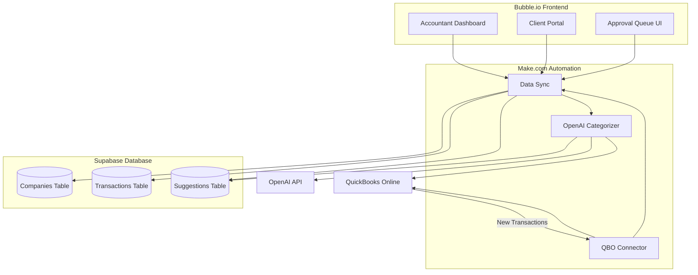

# DaxHive Simplified Architecture (No-Code/Low-Code)

## For Non-Technical Founders

This is a **realistic, achievable version** you can build **without coding knowledge**, with my guidance.

---

## Simplified Tech Stack

| Component | Tool | Why | Cost |
|-----------|------|-----|------|
| **Frontend** (User Interface) | Bubble.io | Visual drag-and-drop builder | $29-119/mo |
| **Automation** (QBO ↔ AI ↔ Data) | Make.com | Visual workflow builder | $9-29/mo |
| **Database** | Supabase | Easy to use, auto APIs | $25/mo |
| **AI** | OpenAI API | Pre-built intelligence | ~$50/mo |
| **Auth** | Bubble auth (built-in) | Comes free with Bubble | $0 |
| **Payments** | Stripe (via Bubble plugin) | Easy integration | 2.9% + $0.30 |
| **Total** | | | **~$150/month** |

No servers to manage, no code to write (mostly), **you can do this!**

---

## System Architecture



---

## How It Works (Step-by-Step)

### Step 1: User Signs Up (Bubble.io)
- Accountant creates account
- Enters business info
- Clicks "Connect QuickBooks"

### Step 2: QuickBooks Connection (Make.com)
- Make.com triggers OAuth flow
- User logs into QuickBooks
- Access token saved to Supabase

### Step 3: Data Sync (Make.com → Supabase)
**Daily automation:**
1. Make.com fetches new transactions from QBO
2. Saves to Supabase `transactions` table
3. Triggers AI categorization

### Step 4: AI Categorization (Make.com + OpenAI)
**For each transaction:**
1. Make.com fetches transaction details
2. Fetches company's Chart of Accounts from Supabase
3. Sends to OpenAI with prompt:
   ```
   You are a bookkeeper. Categorize this transaction:
   - Vendor: [vendor]
   - Amount: [amount]
   - Memo: [memo]
   
   Available accounts: [chart of accounts]
   
   Return JSON: {account_id: "", account_name: "", confidence: 0-100}
   ```
4. Saves AI suggestion to Supabase

### Step 5: Review (Bubble.io)
- Accountant sees list of transactions
- AI suggestion highlighted
- Click "Approve" or "Change Category"

### Step 6: Post to QuickBooks (Make.com)
- When approved, Make.com updates QBO
- Logs the action
- Marks transaction as complete

---

## Database Schema (Supabase)

I'll create these tables for you. You just need to run the SQL I provide.

### Companies Table
```sql
CREATE TABLE companies (
  id UUID PRIMARY KEY DEFAULT uuid_generate_v4(),
  accountant_id UUID REFERENCES auth.users(id),
  company_name TEXT,
  qbo_realm_id TEXT,
  qbo_access_token TEXT, -- encrypted
  qbo_refresh_token TEXT, -- encrypted
  industry TEXT,
  created_at TIMESTAMP DEFAULT NOW()
);
```

### Transactions Table
```sql
CREATE TABLE transactions (
  id UUID PRIMARY KEY DEFAULT uuid_generate_v4(),
  company_id UUID REFERENCES companies(id),
  qbo_transaction_id TEXT,
  vendor TEXT,
  amount DECIMAL,
  transaction_date DATE,
  memo TEXT,
  status TEXT DEFAULT 'pending', -- pending, approved, posted
  created_at TIMESTAMP DEFAULT NOW()
);
```

### AI Suggestions Table
```sql
CREATE TABLE ai_suggestions (
  id UUID PRIMARY KEY DEFAULT uuid_generate_v4(),
  transaction_id UUID REFERENCES transactions(id),
  suggested_account_id TEXT,
  suggested_account_name TEXT,
  confidence INT,
  reasoning TEXT,
  approved BOOLEAN DEFAULT FALSE,
  created_at TIMESTAMP DEFAULT NOW()
);
```

### Chart of Accounts Cache
```sql
CREATE TABLE chart_of_accounts (
  id UUID PRIMARY KEY DEFAULT uuid_generate_v4(),
  company_id UUID REFERENCES companies(id),
  qbo_account_id TEXT,
  account_name TEXT,
  account_type TEXT,
  is_active BOOLEAN DEFAULT TRUE,
  synced_at TIMESTAMP DEFAULT NOW()
);
```

---

## Implementation Steps (I'll Guide You)

### Week 1: Setup

#### Day 1-2: Create Accounts
- [ ] Sign up for Bubble.io (free trial)
- [ ] Sign up for Make.com (free tier)
- [ ] Sign up for Supabase (free tier)
- [ ] Sign up for OpenAI API ($5 credit)
- [ ] Create Intuit Developer account

#### Day 3-4: Database Setup
- [ ] I'll give you SQL to run in Supabase
- [ ] You copy-paste into Supabase SQL editor
- [ ] Run, verify tables created

#### Day 5-7: QuickBooks OAuth
- [ ] I'll create a Make.com template for you
- [ ] You import to your account
- [ ] Test connection with QBO Sandbox

---

### Week 2: Core Automation

#### Make.com Scenarios (I'll build templates for you):

**Scenario 1: Fetch Transactions**
- Trigger: Daily at 2 AM
- Steps:
  1. Get all active companies from Supabase
  2. For each company, call QBO API `/query?select=* from Purchase`
  3. Save new transactions to Supabase

**Scenario 2: AI Categorization**
- Trigger: New transaction in Supabase
- Steps:
  1. Get transaction details
  2. Get company's Chart of Accounts
  3. Build prompt for OpenAI
  4. Call OpenAI API
  5. Parse JSON response
  6. Save to `ai_suggestions` table

**Scenario 3: Post to QuickBooks**
- Trigger: Suggestion marked "approved" in Supabase
- Steps:
  1. Get transaction + approved category
  2. Call QBO API to update transaction
  3. Mark transaction as "posted"

---

### Week 3-4: Bubble.io Interface

**I'll create a Bubble template for you** with:

#### Accountant Dashboard Page
- Company list (connected to Supabase)
- "Add Company" button → triggers QBO OAuth
- For selected company:
  - Transaction list
  - AI suggestion shown
  - Approve/Reject buttons

#### Approval Queue Component
```
┌─────────────────────────────────────────────┐
│ Pending Transactions (23)                   │
├─────────────────────────────────────────────┤
│ Staples          $47.32    Jan 15, 2026     │
│ AI: Office Supplies (95% confident)         │
│ [✓ Approve] [✏️ Change] [Details]           │
├─────────────────────────────────────────────┤
│ Uber Eats        $18.50    Jan 14, 2026     │
│ AI: Meals (72% confident) ⚠️ Low confidence │
│ [✓ Approve] [✏️ Change] [Details]           │
└─────────────────────────────────────────────┘
```

---

## What I'll Provide You

### 1. Make.com Templates (JSON to import)
- Pre-built workflows
- You just add your API keys
- Click "Run" to test

### 2. Supabase SQL Scripts
- Copy-paste into SQL editor
- Creates all tables automatically
- Includes indexes for speed

### 3. Bubble.io Template
- Drag-and-drop pages already designed
- Connected to Supabase (you add credentials)
- Styled with modern UI

### 4. OpenAI Prompt Templates
- Optimized for bookkeeping
- Returns structured JSON
- Includes confidence scoring

---

## What You Need to Do

### Your Responsibilities:
1. **Sign up for services** (I'll give you links)
2. **Copy-paste code/configs** I provide
3. **Get API credentials** (OpenAI, QuickBooks)
4. **Test the workflows** (click buttons, verify it works)
5. **Customize the UI** (change colors, add your logo)

### Skills Required:
- ✅ Can follow step-by-step instructions
- ✅ Comfortable clicking around web interfaces
- ✅ Can copy-paste text
- ❌ NO coding needed!

---

## Limitations of This Approach

**What's NOT included** (compared to full ML platform):

| Feature | Included? | Why Not? |
|---------|-----------|----------|
| Per-client RAG | ❌ | Too complex for no-code |
| Fine-tuned models | ❌ | Requires Python/ML expertise |
| Hierarchical learning | ❌ | Advanced architecture |
| DOE framework | ❌ | Needs data science setup |
| Tenant training UI | ❌ | No models to train |
| <500ms latency | ⚠️ | OpenAI API takes 1-3 seconds |
| 95%+ accuracy | ⚠️ | Plateaus at 85-90% |

**What DOES work:**
- ✅ QuickBooks integration
- ✅ AI categorization (GPT-4)
- ✅ Approval workflow
- ✅ Multi-client management
- ✅ Posting back to QBO
- ✅ Audit trail
- ✅ Basic reporting

**Is this good enough?** For an MVP: **YES!** Get customers, then upgrade.

---

## Cost Breakdown (100 companies, 1000 txns/month each)

| Item | Calculation | Monthly Cost |
|------|-------------|--------------|
| Bubble.io | Professional plan | $119 |
| Make.com | Pro plan (10K ops) | $29 |
| Supabase | Pro plan | $25 |
| OpenAI API | 100K txns × $0.01 | $1,000 |
| QBO API | Free (first 25 companies) | $0 |
| **Total** | | **$1,173/month** |

**Per company:** $11.73/month in costs  
**Charge:** $50-100/month  
**Margin:** **$38-88/month per company**  
**At 100 companies:** $3,800-8,800/month profit

---

## Timeline

### Week 1: Setup & Learning
- Create accounts
- Run through tutorials
- Test each tool individually

### Week 2: Database & QBO Integration
- Set up Supabase tables
- Connect to QuickBooks Sandbox
- Fetch first transactions

### Week 3: AI Integration
- Set up OpenAI prompts
- Test categorization
- Verify accuracy

### Week 4: Build UI
- Import Bubble template
- Customize branding
- Connect to Supabase

### Week 5-6: Testing
- Invite 2-3 beta users (accountants you know)
- Gather feedback
- Fix issues

### Week 7-8: Launch
- Create landing page
- Start marketing
- Onboard first paying customer!

---

## Next Steps

If you want to go this route:

1. **Tell me:** "Yes, let's do the simplified version"
2. **I'll create:**
   - Make.com template (with instructions)
   - Supabase SQL scripts
   - Bubble.io template
   - Setup guide (step-by-step)

3. **You'll need:**
   - 5-10 hours/week for 8 weeks
   - ~$200 budget for tools
   - Willingness to learn new platforms

**Ready to start?**
