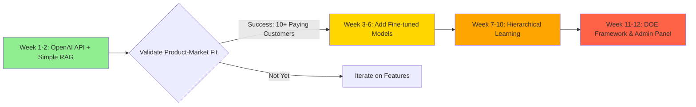

# Approach Comparison: Simple vs ML-First

## Decision Matrix

| Aspect | **Approach A: Simple (OpenAI API)** | **Approach B: ML-First (RAG + Models)** |
|--------|-------------------------------------|----------------------------------------|
| **Time to MVP** | ✅ 2-3 weeks | ⚠️ 8-12 weeks |
| **Initial Complexity** | ✅ Low (just API calls) | ❌ High (ML infra needed) |
| **Cost per Transaction** | ⚠️ $0.01-0.02 | ✅ $0.0036 (after training) |
| **Accuracy (Initial)** | ✅ 85-90% (GPT-4 is smart) | ⚠️ 80-85% (needs training data) |
| **Accuracy (After 6 months)** | ⚠️ 85-90% (no learning) | ✅ 95-98% (continuous learning) |
| **Latency** | ⚠️ 1-3 seconds (API call) | ✅ <500ms (local inference) |
| **Customization** | ❌ Limited (prompt engineering only) | ✅ Full control (custom models) |
| **Privacy** | ⚠️ Data sent to OpenAI | ✅ Models can run locally |
| **Offline Capability** | ❌ Requires internet | ✅ Yes (after model download) |
| **Vendor Lock-in** | ⚠️ Dependent on OpenAI | ✅ Own models, portable |
| **Maintenance** | ✅ Low (managed by OpenAI) | ⚠️ Medium (model updates, monitoring) |
| **Scalability (1000 companies)** | ⚠️ API rate limits | ✅ Unlimited (self-hosted) |

---

## Hybrid Approach: Best of Both Worlds

**Recommendation:** Start with **Approach A**, progressively adopt **Approach B** features.

### Phase 1: OpenAI API Only (Weeks 1-2)
- Quick validation of the core concept
- Get early customer feedback
- Prove the value proposition

### Phase 2: Add RAG (Weeks 3-4)
- Store company-specific context
- Reduce OpenAI costs by providing better context
- Improve accuracy with historical data

### Phase 3: Fine-tuned Models (Weeks 5-8)
- Train small models for high-frequency companies
- Keep OpenAI as fallback for edge cases
- Reduce costs significantly

### Phase 4: Full ML Platform (Weeks 9-12)
- Hierarchical learning
- DOE framework
- Admin controls

---

## Cost Comparison (100 companies, 1000 txns/month each)

### Scenario: 100,000 transactions/month

| Approach | Monthly Cost | Annual Cost | Notes |
|----------|-------------|-------------|-------|
| **100% OpenAI GPT-4** | $1,500 | $18,000 | Consistent, no training |
| **RAG + GPT-4 (50% reduction)** | $750 | $9,000 | Better context = fewer calls |
| **RAG + Local Models (90% local)** | $360 | $4,320 | Only use GPT-4 for edge cases |
| **Full ML Platform** | $360 + $500 infra | $10,320 | Includes ML infrastructure costs |

**Breakeven:** If you plan to scale beyond **50 companies**, the ML platform pays for itself.

---

## Technical Debt Analysis

### Approach A (OpenAI Only)
**Debt Incurred:**
- Hard to migrate to custom models later (different data format)
- No learning infrastructure in place
- Difficult to explain "why" AI chose a category (black box)

### Approach B (ML-First)
**Debt Incurred:**
- Over-engineering if you don't reach scale
- Complexity may slow down feature development
- Requires ML expertise on the team

**Mitigation:** Build Approach B in a way that each phase delivers standalone value.

---

## Recommended Path

### Why This Works:
1. **De-risks the investment**: Prove the concept before heavy ML work
2. **Continuous value**: Each phase adds measurable improvement
3. **Learn from real data**: Build ML models based on actual usage patterns, not assumptions
4. **Easier fundraising**: Show traction first, then invest in defensible tech

---

## What I Recommend for DaxHive

Given that you're building this from scratch and learning as you go, I suggest:

### **Start: Hybrid Approach (RAG + OpenAI)**

**Week 1-2: MVP**
- QuickBooks OAuth integration
- Fetch transactions
- Store historical data in **Qdrant** (RAG-ready)
- Use **GPT-4 with chain-of-thought** prompting
- Simple approval UI

**Deliverable:** Working prototype you can demo.

**Week 3-4: RAG Enhancement**
- Build company-specific RAG collections
- Include historical transactions in GPT-4 context
- Measure accuracy improvement (target: +10%)

**Deliverable:** Improved accuracy, lower OpenAI costs.

**Week 5-8: Add ML Models (Optional - Based on Traction)**
- If you have 5+ paying customers, justify the investment
- Train DistilBERT models for each company
- A/B test: ML model vs OpenAI
- Keep the winner

**Deliverable:** Proof that custom models work for your use case.

**Week 9+: Platform Features**
- Hierarchical learning
- DOE framework
- Admin controls
- These become your **competitive moat**

---

## My Questions to Help You Decide

1. **Timeline**: Do you need something working in 2 weeks (demo/fundraising) or can you invest 3 months first?

2. **Team**: Do you have ML expertise, or are you learning as you build?

3. **Scale Expectations**: How many companies do you realistically expect in Year 1?
   - <10: Start simple
   - 10-50: Hybrid approach
   - 50+: Full ML platform justified

4. **Budget**: Can you invest in ML infrastructure ($500-1000/month) from day 1?

Let me know your answers, and I'll tailor the implementation plan accordingly!
